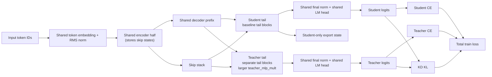
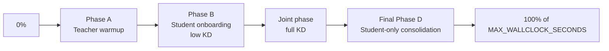

# Shared-Trunk, Branched-Tail Distillation

This note documents the current branch-tail experiment in this repo: the hypothesis, the implementation in [`train_gpt_branch_tail.py`](../train_gpt_branch_tail.py), and the current and proposed experiment sets.

The baseline trainer remains [`train_gpt.py`](../train_gpt.py). The experimental fork is [`train_gpt_branch_tail.py`](../train_gpt_branch_tail.py).

## Goal

Train a stronger model under the same wall-clock budget by adding **temporary teacher capacity only in the tail**, while exporting and evaluating only the **student-sized** model.

Primary success metric:

- `final_val_bpb` on the **exported student-only model** after the script's final int8+zlib roundtrip.

## Core Hypothesis

The working hypothesis is:

1. A stronger tail can improve the shared trunk during training, even if that extra capacity is never exported.
2. The student should benefit from both:
   - its own next-token cross-entropy loss
   - distillation from the teacher logits
3. The most efficient place to add temporary capacity is late in the network, so most compute still flows through a shared trunk.
4. Because the final metric ignores the teacher entirely, the end of training should likely shift toward **student-only consolidation**.

## What The Baseline Actually Looks Like

The baseline model in this repo is not a plain decoder stack. It is a skip-connected split stack with:

- a first half that behaves like an encoder and stores skip states
- a second half that behaves like a decoder and consumes those skips in reverse order

That matters because the branch-tail implementation preserves this structure rather than rewriting the model into a different architecture family.

With the current default settings in [`train_gpt_branch_tail.py`](../train_gpt_branch_tail.py):

- `NUM_LAYERS=9`
- `BRANCH_TAIL_LAYERS=2`
- encoder layers: `4`
- shared decoder prefix: `3`
- branched tail layers: `2`

So the default experimental shape is:

- 4 shared encoder layers
- 3 shared decoder layers
- 2 student tail layers
- 2 teacher-only tail layers

## Model Diagram



## Implemented Architecture

The experimental model is [`BranchedTailGPT`](../train_gpt_branch_tail.py), which keeps the baseline path intact and adds teacher-only tail modules.

Shared components:

- token embedding
- encoder blocks
- shared decoder-prefix blocks
- final norm
- LM head / tied embedding projection

Student-exported components:

- all baseline `blocks.*`
- `skip_weights`
- shared embedding / norm / head

Teacher-only components:

- `teacher_tail_blocks`
- `teacher_skip_weights`

Important implementation detail:

- The teacher tail is made of **full blocks**, not only FFN matrices.
- The main extra capacity knob is still `TEACHER_MLP_MULT`, so the teacher's FFN is wider.
- But because the teacher tail uses separate `Block` instances, it also has separate tail attention weights and control parameters.

Export behavior:

- `student_export_state_dict()` filters out `teacher_tail_blocks.*` and `teacher_skip_weights`.
- Final artifact size and final `val_bpb` are computed from the filtered student export, not from the full training model.

## Losses

The current trainer uses logits-only distillation:

```text
L = w_s * CE(student) + w_t * CE(teacher) + w_kd * KL_T(teacher || student)
```

Where:

- `CE(student)` is student next-token cross-entropy
- `CE(teacher)` is teacher next-token cross-entropy
- `KL_T` is KL divergence between softened teacher and student logits
- teacher logits are detached inside the KD term
- the KD implementation multiplies by `T^2`

Current implementation status:

- Implemented: logits KD
- Not implemented: attention KD
- Not implemented: hidden-state matching

## Timed Schedule

The schedule is now driven by **elapsed wall-clock fraction**, not fixed step counts.

Relevant env vars:

- `PHASE_A_FRAC`
- `PHASE_B_FRAC`
- `PHASE_D_FRAC`
- `MAX_WALLCLOCK_SECONDS`

For branched-tail runs, `MAX_WALLCLOCK_SECONDS` must be positive. Phase progress is:

```text
progress = elapsed_ms / max_wallclock_ms
```

Current phase logic:

1. `teacher_warmup`
   - active while `progress < PHASE_A_FRAC`
   - weights: student CE `0.0`, teacher CE `1.0`, KD `0.0`
2. `student_onboarding`
   - active while `progress < PHASE_A_FRAC + PHASE_B_FRAC`
   - weights: student CE `1.0`, teacher CE `1.0`, KD `0.25 * KD_WEIGHT_MAX`
3. `joint`
   - active until the final consolidation window
   - weights: student CE `1.0`, teacher CE `1.0`, KD `KD_WEIGHT_MAX`
4. `student_consolidation`
   - active in the last `PHASE_D_FRAC` of the run
   - weights: student CE `1.0`, teacher CE `0.0`, KD `0.0`
   - teacher forward path disabled

The current trainer validates that:

- each phase fraction is in `[0, 1]`
- `PHASE_A_FRAC + PHASE_B_FRAC <= 1.0`

### Schedule Diagram



## Experiment Harness

Current launch scripts live in [`runs/`](../runs/).

Shared defaults from [`runs/_common.sh`](../runs/_common.sh):

- `WANDB_ENABLE=1`
- `WANDB_PROJECT=parameter-golf`
- `WANDB_ENTITY=jackpenn`
- `WANDB_RUN_GROUP=single-h100-30m`
- `SINGLE_H100_30M=1`
- `GRAD_ACCUM_STEPS=8`
- `TRAIN_BATCH_TOKENS=524288`
- `TRAIN_SEQ_LEN=1024`
- `PHASE_A_FRAC=0.10`
- `PHASE_B_FRAC=0.20`
- `PHASE_D_FRAC=0.20`

Interpretation:

- this repo is currently set up for **30 minutes on 1xH100** screening runs
- this is a practical experiment budget, not a formal leaderboard submission config by itself

## Current Run Matrix

| Script | Purpose | Key settings |
|---|---|---|
| `runs/01_baseline_seed1337.sh` | Student-only baseline | `BRANCH_TAIL_LAYERS=0` |
| `runs/02_branch_k2_t4_no_kd.sh` | Branch-tail without KD | `k=2`, `teacher_mlp_mult=4`, `KD_WEIGHT_MAX=0`, no warmup, no consolidation |
| `runs/03_branch_k2_t4_kd.sh` | KD without final consolidation | `k=2`, `teacher_mlp_mult=4`, `A=0.10`, `B=0.20`, `D=0.0` |
| `runs/04_branch_k2_t4_kd_consolidate.sh` | KD with final consolidation | `k=2`, `teacher_mlp_mult=4`, `A=0.10`, `B=0.20`, `D=0.20` |
| `runs/05_branch_k2_t8_kd.sh` | Larger teacher, no consolidation | `k=2`, `teacher_mlp_mult=8`, `A=0.10`, `B=0.20`, `D=0.0` |
| `runs/06_branch_k2_t8_kd_consolidate.sh` | Larger teacher with consolidation | `k=2`, `teacher_mlp_mult=8`, `A=0.10`, `B=0.20`, `D=0.20` |
| `runs/07_branch_k1_t8_kd_consolidate.sh` | Shallower branch, wider teacher | `k=1`, `teacher_mlp_mult=8`, `A=0.10`, `B=0.20`, `D=0.20` |
| `runs/08_branch_k2_t4_kd_consolidate_no_warmup.sh` | No teacher warmup ablation | `k=2`, `teacher_mlp_mult=4`, `A=0.0`, `B=0.20`, `D=0.20` |
| `runs/09_branch_k2_t8_kd_consolidate_seed2024.sh` | Second-seed check for a stronger teacher config | `k=2`, `teacher_mlp_mult=8`, seed `2024`, `A=0.10`, `B=0.20`, `D=0.20` |

## What Matters In W&B

Many metrics are logged, but the ranking metric is simple:

- use `final_val_bpb`

That number is measured on:

- the student-only export
- after the script's final int8+zlib roundtrip

Useful supporting diagnostics:

- `student_ce`
- `teacher_ce`
- `kd_kl`
- `phase`
- `phase_progress`
- `tokens_per_sec`
- `peak_memory_allocated_mib`
- `peak_memory_reserved_mib`

## Current Strengths Of This Implementation

- Keeps the original baseline path intact.
- Makes teacher capacity easy to strip at export time.
- Preserves a clean student-only final metric.
- Adds W&B logging and reproducible launch scripts.
- Uses timed scheduling, which is a better fit for fixed wall-clock runs than step-count scheduling.

## Current Limitations

- Teacher capacity is added with full tail blocks, not a pure FFN-only branch.
- The KD schedule is piecewise constant except for the phase jump from low KD to full KD.
- Only logits KD is implemented.
- There is no automatic batch-size / VRAM calibration yet.
- The current script family explores only a narrow slice of schedule space.

## Recommended Next Schedule-Only Study

If the next round focuses only on schedule, the most informative set would be:

1. **Teacher-first + consolidation**
   - current default shape
   - best guess for the highest-probability winner
2. **Teacher-first without consolidation**
   - isolates whether the final student-only finish is helping
3. **No warmup**
   - tests whether early teacher-only optimization is necessary
4. **Longer onboarding**
   - keep `PHASE_A_FRAC` fixed, increase `PHASE_B_FRAC`
   - tests whether a softer KD ramp helps
5. **Shorter teacher warmup**
   - reduce `PHASE_A_FRAC`
   - tests whether teacher warmup is over-allocating scarce 30-minute budget

Concretely, a good next timed sweep would keep the architecture fixed and vary only:

- `PHASE_A_FRAC in {0.00, 0.05, 0.10, 0.15}`
- `PHASE_B_FRAC in {0.10, 0.20, 0.30}`
- `PHASE_D_FRAC in {0.00, 0.10, 0.20}`

Decision rule:

- choose the schedule with the best `final_val_bpb`
- break ties using stability, throughput, and peak memory

## Bottom Line

The repo now supports the core experiment:

- train a shared-trunk model with a temporary teacher branch in the tail
- distill into the student during training
- export only the student
- evaluate only the exported student with `final_val_bpb`

The architecture is implemented, the schedule is timed, the launch scripts are in place, and the main remaining question is which schedule shape gives the best student under the fixed 30-minute single-H100 budget.
