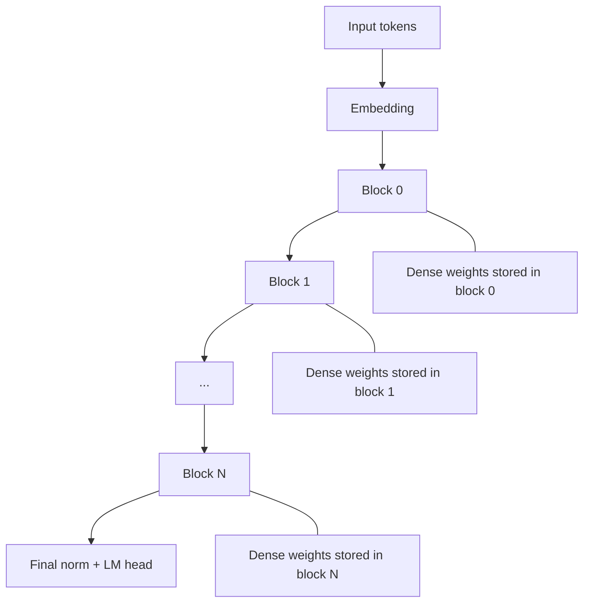
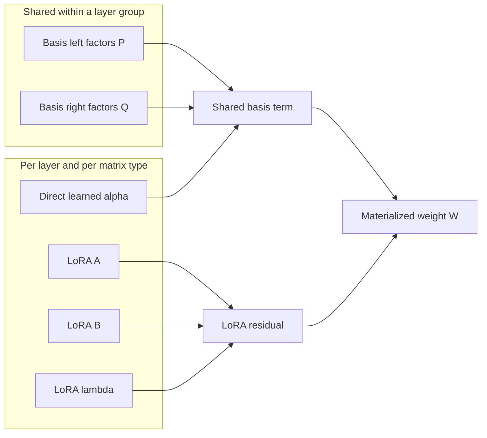
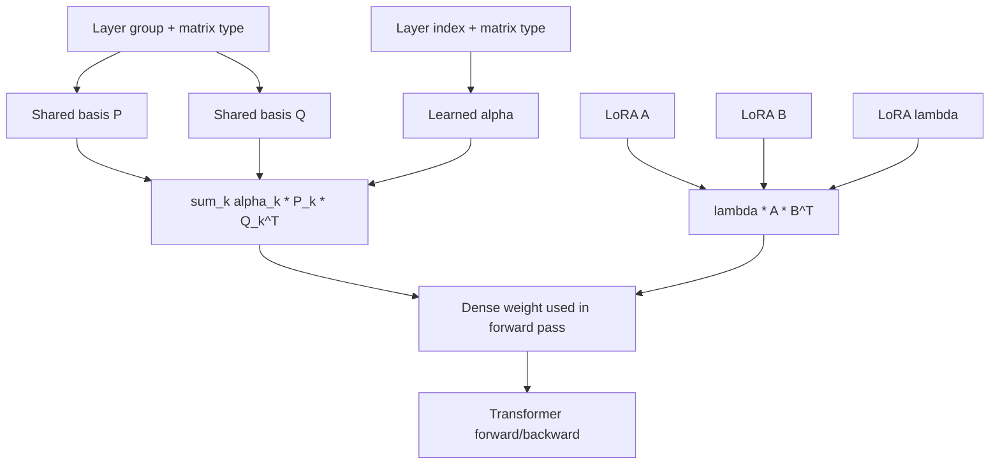
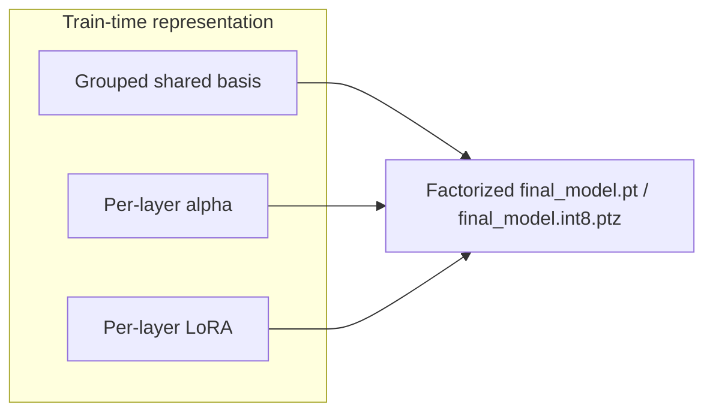

# HyperLoRA Visual Guide

This note explains the new training approach relative to the baseline GPT in this repo.

The short version:

- Baseline: each transformer layer stores and trains its own dense weight matrices directly.
- Grouped-basis HyperLoRA: each layer's weight matrix is generated from a group-shared basis plus a per-layer LoRA residual during training.
- Export: by default we keep the shared basis + alpha + LoRA form in the checkpoint, and rebuild dense weights inside the HyperLoRA modules at inference time.

## 1. Baseline

In the baseline script, each transformer block owns dense matrices for:

- attention `Q`
- attention `K`
- attention `V`
- attention output projection
- MLP up projection
- MLP down projection

That means the model is conceptually:



Each block stores its own full matrices, trains them directly, and exports them directly.

## 2. HyperLoRA Idea

Instead of storing each layer's full matrix independently, we build each matrix from two pieces:

1. A shared basis term
2. A per-layer LoRA residual

For one matrix type in one layer:

```text
W(layer, type) = sum_k alpha_k(layer, type) * P_k(group(layer), type) * Q_k(group(layer), type)^T
               + lambda(layer, type) * A(layer, type) * B(layer, type)^T
```

Where:

- `P_k, Q_k` are shared basis factors for a matrix type within a layer group
- `alpha_k` are per-layer mixing coefficients
- `A, B, lambda` are per-layer LoRA parameters

## 3. What Is Shared vs What Is Per-Layer



The important idea is that the basis is reused within layer groups, while LoRA gives each layer room to be different.

## 4. What Happens During Training

During training, the script does not optimize a normal dense matrix for each linear layer.

Instead it optimizes:

- group-shared basis factors
- direct learned per-layer alpha coefficients
- per-layer LoRA factors
- the usual non-matrix parameters like scales, norms, embeddings, and skip weights

So the training graph looks like this:



This gives training extra structure and extra capacity:

- the grouped shared basis learns patterns reused by nearby layers
- the direct alpha table learns how each layer should mix those shared patterns
- the LoRA residual learns local corrections for each layer

## 5. Why This Can Be "Larger Than Baseline" During Training

The train-time system can be larger than baseline because it includes extra generator machinery:

- basis factors
- direct per-layer alpha coefficients
- per-layer LoRA factors

So at training time, the optimizer is updating more than just the final dense model weights.

And now we do ship that structured generator.

The point is to keep the checkpoint in the shared format so the artifact can be smaller than a dense baseline-shaped export.

## 6. Why Export Stays Factorized

The default export path in this branch is `EXPORT_MODE=factored`.

At export time we do this:



So the final saved model is a factorized HyperLoRA checkpoint:

- shared basis tensors
- direct per-layer alpha tensors
- per-layer LoRA tensors
- the usual non-hyper tensors

At inference, each `HyperLoRALinear` computes:

```text
W = Σ_k alpha_k P_k Q_k^T + lambda A B^T
```

inside the forward pass instead of loading a pre-materialized dense matrix from disk.

## 7. Mental Model

Baseline says:

> "Learn every layer's matrix directly."

HyperLoRA says:

> "Learn a grouped shared dictionary of matrix patterns, learn direct per-layer mixing coefficients for that dictionary, and add a small layer-specific correction."

Then export says:

> "Now freeze the shared factors, save them directly, and reconstruct dense weights on demand during inference."

## 8. Why This Is Useful

This approach is trying to get the best of both worlds:

- richer train-time parameterization than baseline
- stronger sharing across nearby layers than baseline
- layer-specific flexibility through LoRA
- a smaller shared-format artifact at the end

So you pay some complexity at both training time and inference time, in exchange for a more compact checkpoint.

## 9. Baseline vs HyperLoRA Summary

| Aspect | Baseline | HyperLoRA |
|---|---|---|
| Per-layer matrices | Stored directly | Generated from basis + LoRA |
| Cross-layer sharing | None beyond optimization dynamics | Explicit grouped shared bases |
| Layer specialization | Dense weights themselves | Direct alpha mixing + LoRA residual |
| Train-time machinery | Simple | More complex |
| Export artifact | Dense GPT | Factorized HyperLoRA by default in this branch |
| Exported parameter count | Baseline count | Depends on basis sharing and LoRA size |

## 10. One-Line Summary

HyperLoRA trains and exports a shared weight generator, then rebuilds dense weights on demand during inference.
